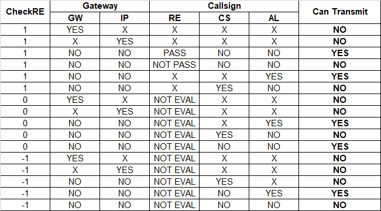

# pYSFReflector
This is a YSF Reflector implemented in python3, mainly compatible with g4klx reflector.

## Additional Features
### Enhanced Blocking List
With the enhanced blocking list you are able to mute calls based on

* callsign of sender
* callsign of gateway used
* ip-address of gateway

### Blocking On Regular Expression Callsign Check
It is also possible to use (by default enabled in the YSFReflector.ini) a callsign check based on a regular expression to check the callsign plausibility in callsign-format and length.

The result of this check can be overdriven by a whitelist-entry in the blocklist (for example: N0CALL is blocked by default by this expression but could be allowed for special bridging situations).

### Muting Matrix
Here you see a matrix documenting the behavior of the blocking-lists and configuration of regular expression (RE)-check:

Within this table following descriptions for the cell-values should help understanding the table:
* X: Any value
* YES: set and matches with callsign/gateway/ip-address	
* NO: not set	
* 1: check via RE enabled, normal operation	
* 0: check via RE disabled, but passes everything	
* -1: check via RE disabled, but only pass whitelist	

### Avoiding Parallel Incomming Transmissions
There is also a functionality implemented that prohibits parallel transmissions that can happen if two senders transmit at the same time. Here the principle 'first-comes-first-serves' is realized, so the second station in time will just be muted to not disturb the audio.

## Easy Installation And Upgrade
Depending on your used operating system and python3-installation you just have to take care that following libraries are installed:

* bisect
* configparser
* datetime
* os
* queue
* re
* signal
* socket
* struct
* sys
* threading
* time

In most installations this packages are already installed, otherwise you easily can install them with your system-package-manager (for example Debian: apt) or you use pip3 install <package>-command.

The configuration file (YSFReflector.ini) is based on the origin YSFReflector.ini of G4KLX's YSFReflector but with added new configuration-items. So If you know the old reflector-software - configuring this one would be straight forward.

## Best Practise Installation
For getting the best user experience it is recommended to configure your pYSFReflector with the following parameter in the YSFReflector.ini:

`FileRotate=0`

This results in having only one logfile for each program and having it rotated by your linux-system with logrotate if configured.

If you are using the php-based Dashbord by DG9VH (https://github.com/dg9vh/YSFReflector-Dashboard) please leave it at `FileRotate=1`, if you are using the websockets based version (recommended at https://github.com/dg9vh/WSYSFDash) you can use `FileRotate=0`. Take care to configure the dashboard's logtailer.ini in sync to this.

To configure log rotation in Linux take a look at https://www.tecmint.com/install-logrotate-to-manage-log-rotation-in-linux/.
